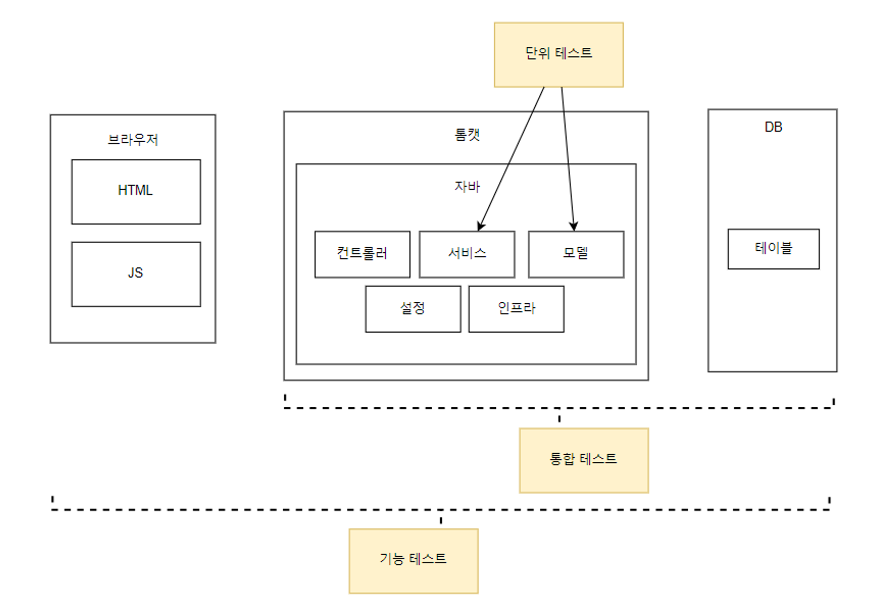

■ 테스트 범위와 종류
-

■ 기능 테스트와 E2E 테스트
- 

- 기능 테스트 : 사용자 입장에서 시스템이 제공하는 기능이 올바르게 동작하는지 확인한다.

기능 테스트를 수행하려면 시스템을 구동해야하기에 모든 구성요소가 필요하다. 

예를들어 회원가입 기능이 있다면 웹 서버, DB, 웹 브라우저가 필요하다.

기능 테스트는 웹 브라우저부터 시작해 DB까지 모든 구성 요소를 테스트하기 때문에 E2E(End to END) 테스트로도 본다.

■ 통합 테스트
-

- 통합 테스트는 시스템의 각 구성 요소가 올바르게 연동되는지 확인한다.
    
통합테스트는 소프트웨어의 코드를 직접 테스트한다. 예를들어 회원가입 기능이 있으면 회원 가입 코드를 직접 테스트 하는 것.

■ 단위 테스트
-

- 지금까지 학습했던 테스트 방식이 단위 테스트이다. 개별 코드나 컴포넌트가 기대한대로 동작하는지 확인하는 것

■ 테스트 범위간 차이
- 

핵심은 통합 테스트나 기능테스트는 외부 시스템과 연동해야하는 기능이 있을 수 있기 때문에 단위 테스트와 대역을 조합해
테스트를 진행하는 것이 좋다.

통합 테스트는 각 구성 요소가 올바르게 연동되는지 확인하기 때문에 자동화 하기 좋은 수단이다.

■ 테스트 범위에 따른 테스트 코드 개수와 시간
- 

- 기능테스트는 모든 환경을 갖춰야하기에 자동화나 상황별 테스트가 어려워 기능테스트를 진행하기 어려울 수 있다.
- 통합테스트는 실행 시간이 짧고 상황 구성이 가능해 많이 작성된다.
- 단위테스트는 통합테스트로 만들기 힘든 상황을 쉽게 구성할 수 있어 많은 코드을 작성하게 된다.

기능 테스트를 진행하면 테스트 내용이 중복되기 때문에 통합, 단위 테스트 는 줄어든다.

■ WireMock 
- 

WireMock은 테스트 목적으로 사용할 수 있는 웹 서버이다. 
WireMock을 사용하면서 특정 포트로 지정한 규칙과 매칭된 HTTP 요청이 들어오면 지정한 응답을 전송한다. 
따라서, 실제 웹 서버가 존재하지 않더라도 HTTP 클라이언트를 테스트할 수가 있다

